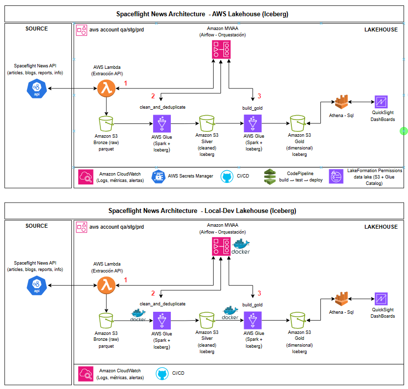
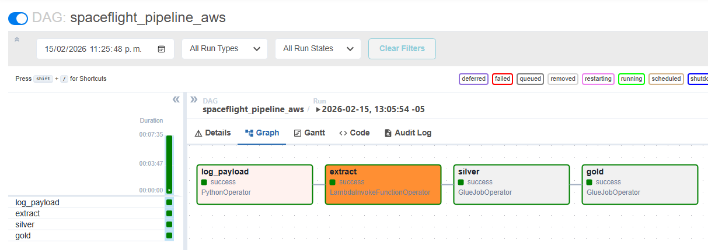
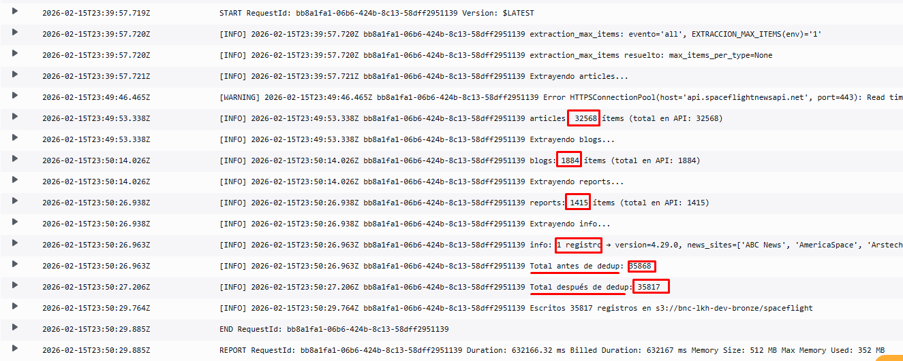
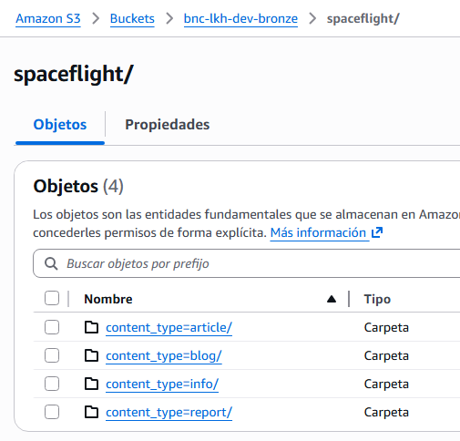
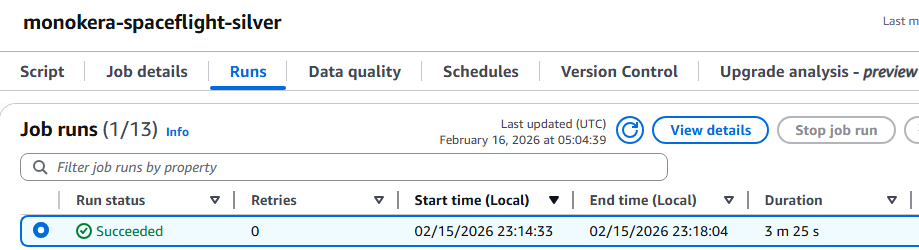
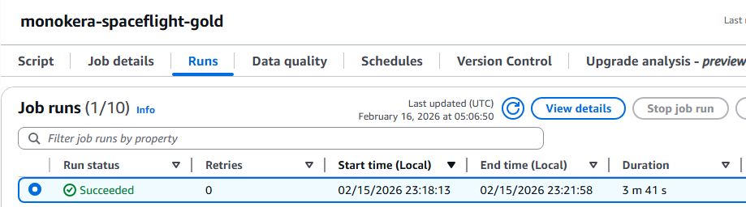
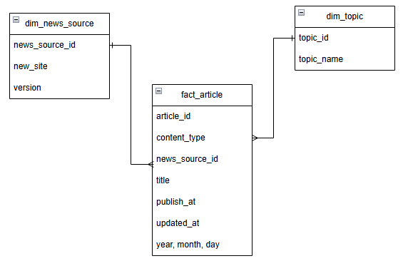
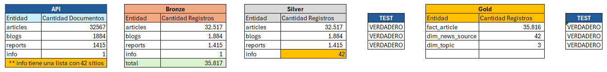
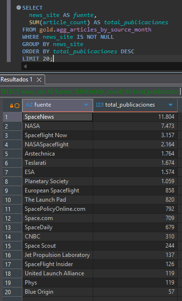
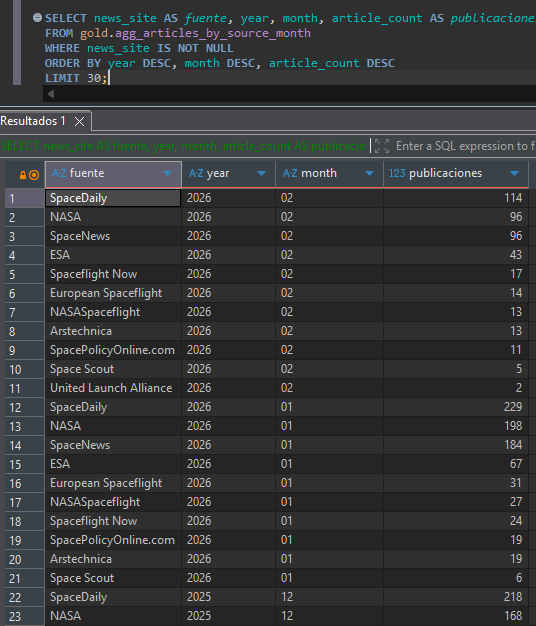

# Documento final de entrega – Pipeline Spaceflight News (Lakehouse Iceberg)

Documento de soporte para la exposición del entregable: arquitectura, flujo end-to-end y evidencias de ejecución.

---

### Imagen 0 – Arquitecturas

---

## 1. Arquitectura

El sistema es un **lakehouse** sobre AWS que ingesta datos de la **Spaceflight News API**, los limpia y deduplica en una capa intermedia (Silver) y los modela en una capa analítica (Gold) con tablas dimensionales y de hechos en **Apache Iceberg**. La orquestación se hace con **Airflow** (local o MWAA), que dispara en secuencia: **Lambda** (extracción) → **Glue Silver** (Bronze → Silver) → **Glue Gold** (Silver → Gold). Las tablas Gold se registran en **Glue Data Catalog** para consulta directa desde **Athena** sin crawlers adicionales.

**Capas:**

| Capa   | Ubicación S3              | Formato  | Origen                    |
|--------|---------------------------|----------|---------------------------|
| Bronze | `s3://...-bronze/spaceflight/` | Parquet  | Lambda (API → Parquet)    |
| Silver | `s3://...-silver/warehouse/silver.db/` | Iceberg  | Glue job clean_and_deduplicate |
| Gold   | `s3://...-gold/warehouse/gold.db/`  | Iceberg  | Glue job content_and_gold |

**Componentes principales:** Spaceflight News API → Lambda (extracción) → S3 Bronze → Glue job Silver (clean_and_deduplicate) → S3 Silver (Iceberg) → Glue job Gold (content_and_gold) → S3 Gold (Iceberg) + Glue Data Catalog → Athena / análisis.

---

## 2. Flujo completo (una ejecución end-to-end)

1. **Trigger del DAG**  
   Se lanza el DAG **spaceflight_pipeline_aws** (o _local_ si se ejecuta en Docker). El DAG tiene cuatro tareas en línea: `log_payload` → `extract` → `silver` → `gold`.

2. **Extract (Lambda)**  
   La tarea `extract` invoca la **Lambda** de extracción con el payload (ruta Bronze, fecha de ingesta, opcionalmente límite de ítems). La Lambda llama a los endpoints de la API (articles, blogs, reports, info), pagina, añade `content_type` y escribe **Parquet** en Bronze particionado por `content_type` y año/mes/día.

3. **Silver (Glue)**  
   El job Glue **clean_and_deduplicate** lee la partición de Bronze correspondiente a la fecha del run, deduplica por `(content_type, id)` y escribe las tablas Iceberg **articles**, **blogs**, **reports**, **info** en Silver.

4. **Gold (Glue)**  
   El job Glue **content_and_gold** lee Silver, construye las dimensiones (**dim_news_source**, **dim_topic**) y la tabla de hechos **fact_article**, y escribe en Gold con MERGE. Con la opción `--catalog_gold glue`, las tablas Gold se crean/actualizan en **Glue Data Catalog**, por lo que Athena las ve de forma inmediata sin crawler.

5. **Consumo**  
   En Athena (o DBeaver conectado a Athena) se consultan las tablas de la base **gold** y las vistas de análisis (tendencias por mes, por fuente, por tipo de contenido, etc.).

---

## 3. Evidencias de ejecución

A continuación se dejan los espacios para insertar las capturas que respaldan la ejecución end-to-end y los resultados.

---

### Imagen 1 – Ejecución del pipeline desde Airflow

---

### Imagen 2 – Logs de Lambda

---

### Imagen 3 – Datos extraídos en Bronze

---

### Imagen 4 – Logs del Glue job Silver

---

### Imagen 5 – Logs del Glue job Gold

---

### Imagen 6 – Modelo de datos

---

### Imagen 7 – Cantidades por capa

Resumen de conteos (referencia):

| Capa   | Entidad         | Cantidad | Nota |
|--------|------------------|----------|------|
| **API**   | articles        | 32 567   | |
|         | blogs           | 1 884    | |
|         | reports         | 1 415    | |
|         | info            | 1        | *info tiene una lista con 42 sitios* |
| **Bronze** | articles      | 32 517   | |
|           | blogs           | 1 884    | |
|           | reports         | 1 415    | |
|           | info            | 1        | |
| **Silver** | articles      | 32 517   | |
|           | blogs           | 1 884    | |
|           | reports         | 1 415    | |
|           | info            | 42       | *explosión de la lista a un registro por sitio* |
| **Gold**   | fact_article    | 35 816   | *articles + blogs + reports (32 517 + 1 884 + 1 415)* |
|           | dim_news_source | 42       | |
|           | dim_topic        | 3        | |

---

### Imagen 8 – Resultados de consultas de análisis de tendencias en Gold

**8.1 – Tendencias de temas por mes**

Volumen de publicaciones por **tipo de contenido** (article, blog, report) y por **mes**, ordenado por tiempo y cantidad. Permite ver la evolución mensual de artículos, blogs y reportes en el dataset.

---

**8.2 – Fuentes más influyentes (volumen total)**

**Fuentes de noticias** con más publicaciones en total histórico, ordenadas por volumen. Identifica los sitios con mayor presencia en el dataset (más publicaciones = mayor influencia).

---

**8.3 – Fuentes por mes reciente**

Top de fuentes por **año y mes** más recientes, con el número de publicaciones en ese periodo. Útil para ver actividad reciente por sitio sin agrupar todo el histórico.

---

## 4. Referencias en el repositorio

- **Parte 1 – Diseño:** `parte1/1diagrama/` (diagrama de arquitectura).
- **Parte 2 – Extracción y procesamiento:** `parte2/21_extraccion/`, `parte2/22_procesamiento/jobs/` (Lambda, clean_and_deduplicate, content_and_gold).
- **Parte 3 – Modelo y análisis:** `parte3/31_disenho_dwh/` (modelo multidimensional), `parte3/32_analisis_sql/` (consultas y vistas).
- **Parte 4 – Pipeline Airflow:** `parte4/41_mapeo_requisitos/`, `parte4/42_codigo_dags/`, `parte4/43_documentacion/`.
- **Configuración y deploy:** `localconfig/airflow/`, `localconfig/glue/`, `localconfig/athena/`.

---

## 5. Requisitos cubiertos, decisiones técnicas y mejoras futuras, decisiones técnicas y mejoras futuras

### Requisitos cubiertos

Mapeo enunciado vs. implementación (detalle en `parte4/41_mapeo_requisitos/01_mapeo_requisitos_prueba.md`):

| Área | Requisito / enunciado | Implementación |
|------|------------------------|----------------|
| **Extracción** | Extracción por tipo (articles, blogs, reports, info) | Una tarea **extract** (LambdaInvokeFunctionOperator): una Lambda con paginación que escribe Parquet en Bronze particionado. |
| **Procesamiento** | Limpieza/dedup y análisis (Silver, Gold) | **silver**: GlueJobOperator (clean_and_deduplicate). **gold**: GlueJobOperator (content_and_gold: dims, fact_article, vistas de tendencias/fuentes). |
| **Carga y análisis** | Gold (dims, hechos, agregados; tendencias y fuentes) | Incluido en la tarea **gold**. Consultas de tendencias en Gold (vistas/v_agg*). Dashboards (QuickSight) no implementado. |
| **DAG** | Orden de tareas | `log_payload >> extract >> silver >> gold`. log_payload opcional (log de extraction_max_items). |

---

### Decisiones técnicas

- **Iceberg:** Formato tabular con particionado, MERGE y time travel. Adecuado para lakehouse con reprocesos y consultas analíticas (Athena). Silver y Gold en Iceberg.
- **Lambda para extracción:** Sin servidores que mantener; pago por invocación; escala automática; el DAG invoca una sola Lambda que pagina la API y escribe Bronze.
- **Glue Data Catalog para Silver y Gold:** Tablas registradas en Glue con `--catalog_silver glue` y `--catalog_gold glue`. Athena ve las bases `silver` y `gold` sin crawlers; las rutas en S3 (silver.db, gold.db) quedan unificadas en el catálogo.

