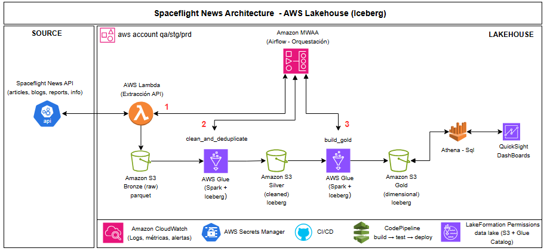

# Diagrama de arquitectura – Spaceflight News AWS Lakehouse (Iceberg)

Diagrama requerido en la Parte 1 (Diseño de arquitectura).

---

## Componentes AWS específicos con justificación

| Componente | Justificación |
|------------|---------------|
| **Spaceflight News API** | Fuente externa de datos: artículos, blogs, reportes e info. Sin costo de licencia; actualización ~cada 10 min. |
| **AWS Lambda (Extracción API)** | Ejecuta el código de extracción (paginación, rate limits, deduplicación) y escribe los datos crudos en **S3 Bronze en formato Parquet**. Sin gestionar servidores; pago por invocación y tiempo; escala automáticamente; ideal para tareas disparadas por el DAG. |
| **Amazon S3 (Bronze, Silver, Gold)** | Almacenamiento del lakehouse: **Bronze** en Parquet (escrito por Lambda); **Silver y Gold** en Iceberg (escritos por Glue). Durabilidad y bajo coste; integración nativa con Glue y Athena. |
| **AWS Glue (Spark + Iceberg)** | Jobs de procesamiento: `clean_and_deduplicate` (Bronze → Silver) y `build_gold` (Silver → Gold). Spark gestionado; soporte para lecturas/escrituras Iceberg; catálogo unificado con Glue Data Catalog. |
| **AWS Glue Data Catalog** | Metadatos de las tablas: Bronze (Parquet) y Silver/Gold (Iceberg). Permite que Glue y Athena resuelvan esquema, particiones y ubicación en S3 sin hardcodear rutas. |
| **Amazon MWAA (Airflow)** | Orquestación del pipeline: dispara Lambda, Glue y flujo en el orden correcto. Airflow gestionado; retries, scheduling y monitoreo integrados. |
| **Amazon Athena** | Consultas SQL sobre las tablas Gold (y Silver si aplica). Serverless; pago por datos escaneados; usa el mismo Glue Catalog. |
| **Amazon QuickSight** | Dashboards y reportes. Se conecta a Athena como fuente de datos; no requiere servidor de BI. |
| **Amazon CloudWatch** | Logs y métricas de Lambda, Glue y MWAA. Alertas ante fallos; transversal a todo el pipeline. |
| **AWS Secrets Manager** | Almacenamiento de secretos (API keys, credenciales). Lambda y Glue los consumen por IAM; evita credenciales en código. |
| **AWS Lake Formation** | Permisos sobre el data lake (S3 + Glue Catalog). Control de acceso por tabla/columna para usuarios y roles. |
| **AWS CodePipeline** | CI/CD: build → test → deploy del código de extracción y de los jobs. |

---

## Flujo de datos detallado

1. **Disparo:** MWAA ejecuta el DAG (ej. diario). La primera tarea invoca **Lambda** (extracción).
2. **Extracción:** Lambda llama a la Spaceflight News API (`/articles`, `/blogs`, `/reports`, `/info`) con paginación; añade el campo **`content_type`** (article | blog | report según el endpoint) y escribe los datos crudos en **S3 Bronze en formato Parquet**, particionado por `content_type` y fecha de ingesta (año/mes/día). Ejemplo de rutas: `.../bronze/content_type=articles/year=2025/month=02/day=13/`, `.../bronze/content_type=blogs/year=2025/month=02/day=13/`, `.../bronze/content_type=reports/year=2025/month=02/day=13/`.
3. **Bronze → Silver:** MWAA lanza el job de Glue **clean_and_deduplicate**. Este job lee desde Bronze (Parquet), limpia, deduplica por `(content_type, id)` (los tres tipos unificados), valida esquema y escribe en **S3 Silver** (tablas Iceberg), particionado por **año/mes/día** (ej. `year=2025/month=02/day=13`) para alinear con Bronze y permitir consultas y reprocesos por tiempo.
4. **Silver → Gold:** MWAA lanza el job de Glue **build_gold**. Lee Silver, aplica el modelo dimensional (dim_news_source, dim_topic, fact_article, agregados) y escribe en **S3 Gold** (tablas Iceberg). Las **tablas de hechos** (ej. fact_article) se particionan por **año/mes/día**; las **dimensiones** (dim_news_source, dim_topic) son pequeñas y no requieren partición temporal.
5. **Catálogo:** Los jobs de Glue registran/actualizan las tablas en **Glue Data Catalog**; las ubicaciones en S3 quedan asociadas a nombres lógicos.
6. **Consumo:** **Athena** consulta las tablas Gold (y Silver si hace falta) usando el catálogo. **QuickSight** usa Athena como fuente y muestra dashboards.
7. **Observabilidad:** Lambda, Glue y MWAA envían logs y métricas a **CloudWatch**; las alertas se configuran sobre esas métricas.

No hay flujo directo QuickSight → Glue Catalog: QuickSight siempre consulta vía Athena, y Athena usa el Glue Catalog para localizar los datos en S3.

---

## Sistema de backup y recuperación

- **S3 – Versionado:** En los buckets del lakehouse (Bronze, Silver, Gold) se habilita **versionado**. Ante borrado accidental o sobrescritura errónea se puede recuperar una versión anterior del objeto.
- **Iceberg – Time travel:** Las tablas Silver y Gold (Iceberg) mantienen snapshots. Si un job escribe datos incorrectos, se puede volver a un snapshot anterior o reprocesar desde Bronze.
- **Bronze como respaldo lógico:** Bronze (Parquet) conserva los datos crudos de la API escritos por Lambda. Si Silver o Gold se corrompen o se pierden, se pueden regenerar re-ejecutando solo los jobs de Glue sin volver a llamar a la API.
- **MWAA – Re-ejecución:** Si falla una tarea (Lambda o Glue), se re-ejecuta solo esa tarea o el DAG desde ese punto. Los datos ya escritos en capas anteriores no se pierden.
- **Backup cruzado (opcional):** En entornos productivos críticos se pueden configurar réplicas de S3 a otra cuenta o región (S3 Replication) para recuperación ante desastre.

---

## Sistema de monitoreo y alertas

El monitoreo de los jobs (Lambda, Glue, DAG en MWAA) se centraliza en **CloudWatch**: logs y métricas de cada componente permiten detectar fallos (tarea fallida, timeout, error en Glue, etc.).

**Alertas en tiempo real:** Cuando un job falla se dispara una **alarma de CloudWatch** (por ejemplo al detectar estado "Failed" en el DAG o en el job de Glue). Esa alarma se conecta a un **hub de notificaciones** que envía el mensaje al canal operativo:

- **Microsoft Teams** o **Slack:** mediante un hub (por ejemplo **AWS Chatbot**, que integra CloudWatch con Teams y Slack, o un webhook propio), se publica en el canal configurado un mensaje indicando **la falla del job**: nombre del DAG o job, hora, y enlace a los logs en CloudWatch para facilitar el diagnóstico.

De este modo el equipo recibe de forma inmediata la notificación en Teams o Slack sin tener que consultar la consola de AWS.

> **Nota:** El envío de alertas a Teams/Slack mediante hub no está incluido en la implementación actual; se considera una **mejora a futuro**.
