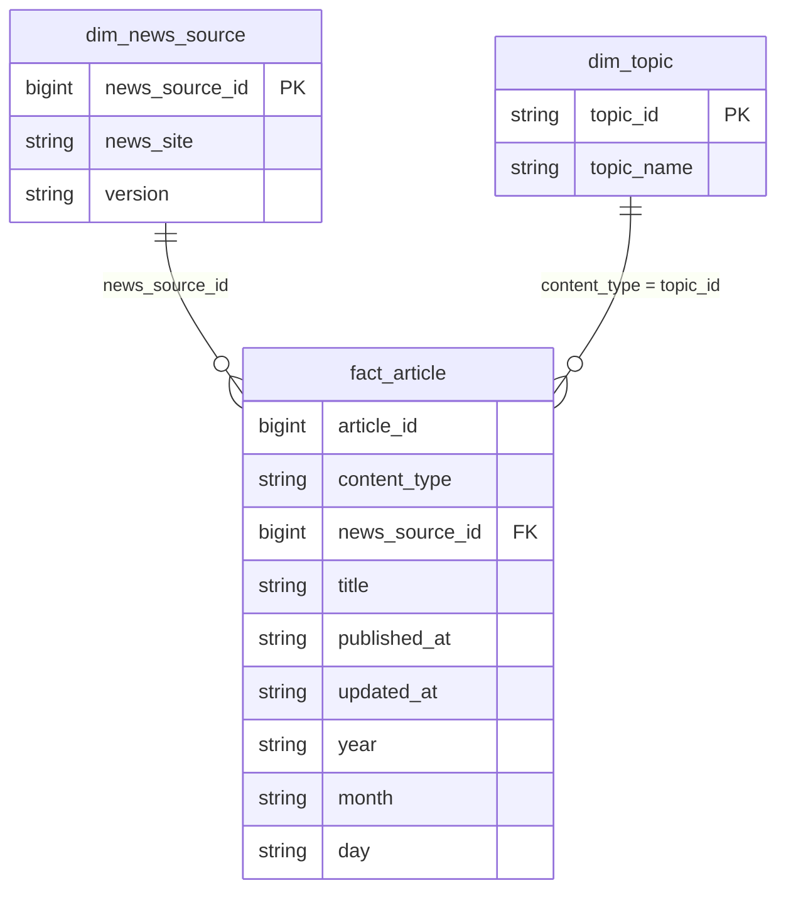

# Modelo multidimensional – Gold (Parte 3.1)

Modelo dimensional del data warehouse sobre la capa Gold (Iceberg). Las tablas son pobladas por el job `content_and_gold` (Spark/Glue) desde Silver.

---

## Diagrama del modelo

```
                    +-------------------------+
                    |   dim_news_source       |
                    |   (dimension)           |
                    +-------------------------+
                    | news_source_id (PK)     |
                    | news_site               |
                    | version                 |
                    +-------------+-----------+
                                  |
                                  | 1
                                  |
                                  | N
                    +-------------v-----------+         +-------------------------+
                    |     fact_article        |         |      dim_topic          |
                    |     (hecho)             |    N    |   (dimension)           |
                    +-------------------------+---------+-------------------------+
                    | article_id              |    1    | topic_id (PK)           |
                    | content_type            |<--------| topic_name              |
                    | news_source_id (FK)     |         +-------------------------+
                    | title                   |
                    | published_at            |
                    | updated_at              |
                    | year, month, day        |
                    +-------------------------+
```

Versión Mermaid (GitHub/GitLab o editores con soporte):



---

## Relaciones y cardinalidad

| Tabla | Tipo | Clave | Relación con fact_article |
|-------|------|-------|----------------------------|
| dim_news_source | Dimensión | news_source_id (PK), news_site (natural) | 1 : N |
| dim_topic | Dimensión | topic_id (PK) | 1 : N |
| fact_article | Hecho | (article_id, content_type) | N : 1 con cada dimensión |

Partición del hecho: **year, month, day** (de `published_at`).

---

## Cómo se llena cada tabla

### dim_news_source

- **Origen:** Silver, tabla `info` (API `/info`, escrita por `clean_and_deduplicate`).
- **Job:** `content_and_gold`, fase **dims**.
- **Lógica:** Lee `silver.info`, GROUP BY news_site con MAX(version). Reutiliza `news_source_id` existente o asigna nuevo (max_id + row_number).
- **Escritura:** MERGE por `news_site`. No DROP+CREATE.

### dim_topic

- **Origen:** Catálogo fijo en el job (article, blog, report).
- **Job:** `content_and_gold`, fase **dims**.
- **Lógica:** Tres filas (topic_id, topic_name).
- **Escritura:** MERGE por `topic_id`.

### fact_article

- **Origen:** Silver: `articles`, `blogs`, `reports` (UNION con content_type).
- **Job:** `content_and_gold`, fase **facts**.
- **Lógica:** JOIN a dim_news_source por news_site; columnas article_id, content_type, news_source_id, title, published_at, updated_at, year, month, day.
- **Escritura:** MERGE por `(article_id, content_type)`. Opcional `--partition_date` para incremental.

---

## Vistas de análisis (Athena)

Vistas definidas sobre las tablas Gold para consultas de tendencias, fuentes y detalle. Objetivo: exponer agregados y joins listos para el consumo (dashboards, análisis SQL de la Parte 3.2) sin duplicar datos.

---

### agg_articles_by_month

**Objetivo:** Ver el volumen de publicaciones por **año y mes** (tendencia temporal global). Sirve para gráficos de evolución mensual del total de artículos/blogs/reports.

```sql
CREATE OR REPLACE VIEW gold.agg_articles_by_month AS
SELECT year, month, COUNT(*) AS article_count
FROM gold.fact_article
GROUP BY year, month;
```

---

### agg_articles_by_source_month

**Objetivo:** Ver el volumen por **fuente de noticias** y por **mes**. Permite analizar qué fuentes publican más en cada periodo (fuentes más influyentes, actividad por sitio y tiempo).

```sql
CREATE OR REPLACE VIEW gold.agg_articles_by_source_month AS
SELECT d.news_site, f.year, f.month, COUNT(*) AS article_count
FROM gold.fact_article f
LEFT JOIN gold.dim_news_source d ON f.news_source_id = d.news_source_id
GROUP BY d.news_site, f.year, f.month;
```

---

### v_agg_articles_by_content_type_month

**Objetivo:** Ver el volumen por **tipo de contenido** (article, blog, report) y por **mes**. Sirve para tendencias de “temas” (artículos vs blogs vs reportes) en el tiempo.

```sql
CREATE OR REPLACE VIEW gold.v_agg_articles_by_content_type_month AS
SELECT content_type, year, month, COUNT(*) AS article_count
FROM gold.fact_article
GROUP BY content_type, year, month;
```

---

### v_fact_article_detail

**Objetivo:** Una fila por publicación con **nombres** de fuente y tema (no solo IDs). Facilita reportes y listados donde se necesita ver `news_site` y `topic_name` sin hacer los joins en cada query.

```sql
CREATE OR REPLACE VIEW gold.v_fact_article_detail AS
SELECT
  f.article_id, f.content_type, f.news_source_id,
  d.news_site, t.topic_id, t.topic_name,
  f.title, f.published_at, f.updated_at, f.year, f.month, f.day
FROM gold.fact_article f
LEFT JOIN gold.dim_news_source d ON f.news_source_id = d.news_source_id
LEFT JOIN gold.dim_topic t ON f.content_type = t.topic_id;
```

---

### v_articles_recent

**Objetivo:** Resumen ligero de las publicaciones más recientes (fuente, tema, título, fecha) para listados “últimos N artículos” o portadas. Se consulta con `ORDER BY published_at DESC LIMIT N`.

```sql
CREATE OR REPLACE VIEW gold.v_articles_recent AS
SELECT f.article_id, f.content_type, d.news_site, t.topic_name, f.title, f.published_at
FROM gold.fact_article f
LEFT JOIN gold.dim_news_source d ON f.news_source_id = d.news_source_id
LEFT JOIN gold.dim_topic t ON f.content_type = t.topic_id;
```
